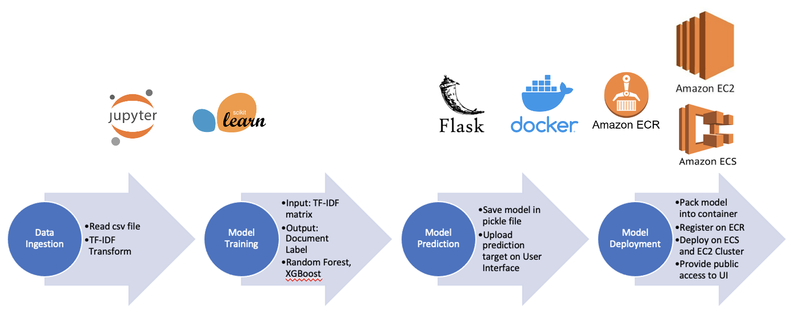

# DocumentClassification

## Introduction
This project is designed as solution to HeavyWater Machine Learning Problem - a document classification case. The problem statement and raw data can be found [here](https://github.com/HeavyWater-Solutions/document-classification-test). The final solution is built based on XGBoost classficiation model, and deployed on AWS platform. To test out the solution and predict your own document, try our [Document Classifcation website](http://ec2-184-73-60-214.compute-1.amazonaws.com:8888). It's open to everyone! 

## Data Description

Raw data for this project is in csv format, with 62203 documents as rows, and two columns for document label and content separately. Here is a sample line:

```
CANCELLATION NOTICE,641356219cbc f95d0bea231b ... [lots more words] ... 52102c70348d b32153b8b30c
```

The dataset contains 14 unique labels, among which BILL is the most frequent one with 18968 documents, while APPLICATION and INTENT TO CANCEL NOTICE are the least with 229 documents. Several documents have empty content, and thus removed from the dataset for training or validation. All content has been processed and encoded, thus no further textual analysis or processing has been conducted on this dataset. 

## Data Preparation and Model Design

To prepare the dataset for classification models, first we split the dataset with stratified sampling into 80% for training and 20% for validation. Then we adopted [TF-IDF (Term Frequency–Inverse Document Frequency)][1] vectorization methods to convert content in each document from a single string to a vector of words' TF-IDF value. 

Once the content has been converted into a TF-IDF matrix, we feed the matrix into the model as input features, and known document labels as output feature. Both Random Forest and XGBoost tree-based model have been experimented as classification algorithms, and generated similar prediction accuracy on validation set. Considering the computation time and memory space, we selected XGBoost as our final output. 

The final model performed quite well on labels with large number of records, ranging from 80% to 93%. However, on labels with few documents, the performance is relatively worse. On average, the prediction accuracy for all labels on validation set is 85%.

## Deployment

The final solution is designed as a RESTful API using Flask. On the User Interface (UI), users can either copy and paste their text content and get the predicted label along with the confidence of prediction, or upload a csv file containing multiple documents to predict in batch. 

For easier application deployment, all code and environment information have been packed up in Docker container. Then the Docker container is regiestered on Amazon Elastic Container Registry (ECR), and deployed with Elastic Container Service (ECS) cluster launching with Elastic Compute Cloud (EC2) instance. 

## Unit Test

A unit test module has been included in `test` folder to test model prediction classes, for both single text prediction and batch prediction. To run the test, type `pytest` and two tests will be executed. 

## Pipeline

This product is designed with four steps:

1. Data Ingestion in Jupyter Notebook
2. Model Training in Jupyter Notebook
3. Model Prediction Restful API designed with [Flask][2]
4. Model Deployment on [AWS][3] using Docker container, ECR registery and ECS with EC2 cluster.



Since the current use case does not have regular data updates, we assume the model training process will not be repeated and no new function will required to be added for foresable future. Therefore, no CI/CD pipeline is included in this solution.

## Demo

Here is a demo for how to use our API:


## Implementation Guidance

To build this solution on your own, follow the steps below:

1. (optional) Update your model and vectorizer with dumping them as `model.pkl` and `vectorizer.pkl` pickle files

2. In Terminal, cd into the `app` folder, and type `docker build -t YOUR_DOCKER_NAME .` to build the Docker image

3. To test out the Docker can run successfully, type `docker run -p 5000:5000 YOUR_DOCKER_NAME `, and go to your [local host server](localhost:5000)

4. Next deploy Docker container on AWS. To set up AWS environment, make sure you installed AWS CLI, and type `aws configure` and input your Access Key ID and Secret Access Key.

5. Login into ECR with `aws ecr get-login-password --YOUR_REGION | docker login --username AWS --password-stdin YOUR_AWS_ACCOUNT_ID.dkr.ecr.YOUR_REGION.amazonaws.com`

6. In [AWS console website](https://console.aws.amazon.com), search for ECR, and create a repository to store the container.

7. Next link the Docker image to ECR, by typing 

   `docker tag YOUR_DOCKER_NAME:latest YOUR_ECR_URI.dkr.ecr.us-east-1.amazonaws.com/YOUR_ECR_REPO_NAME:latest` 

8. To push Docker image to ECR, type 

   `docker push YOUR_ECR_URI.dkr.ecr.us-east-1.amazonaws.com/YOUR_ECR_REPO_NAME:latest`

9. Now the Docker container is in your AWS ECR. Next on AWS console, go to ECS page, and start a ECS cluster with EC2, and configure the cluster as you prefer. If you want to the application to be served to public, remember to enable "Auto assign public IP". This will also automatically start a EC2 instance.

10. Create a task definition for your ECS cluster, and configure it to be EC2 launch type and add your ECR as container

11. Under the created task definition, start a task. This should spin up the server and the application running on EC2.

12. Go to the EC2 instance page, and find the public DNS address. Copy and paste this address in your browser, and you will see the application running.

(Some details were eliminated here. If you are facing any issue, check out this [video](https://youtu.be/zs3tyVgiBQQ) for help.)

## Future Improvement

This is a 1-week project, so the final solution provided here can be considered as a minimum viable product (MVP). There are a lot of room for improvement. Here are some major aspects:

* For security consideration, the content here is all encoded, and thus no textual analysis could be done. If we know the actual words in content, we might be able to extract more useful insights or experiment more meaningful processing methods.
* Due to the dataset size, and the limited time and computation resource, only a small amount of methods and models were tested out, and the hyparameter tuning process is also simplified. If more resource is available, we can also try:
  * other methods of processing document content, such as CountVectorizer, n-gram, word embedding, etc.
  * more feature engineering process, such as dropping out meaningless words, assigning more weight on key words
  * other classification algorithms, such as SVM, LightGBM, MLP, LSTM
  * sampling methods to balance the number of documents for each label, such upsampling, downsampling or SMOTE
* The given dataset is severely imbalanced, and the model performance is compromised on labels with very few documents. If more documents can be collected on these labels, the model could potentially be improved further.
* The User Interface is designed to be straight-forward and blunt. Given more time, we can improve the layout and the user experience as well.

## Reference
[1]: https://en.wikipedia.org/wiki/Tf–idf	"TF–IDF Explanation"
[2]: https://youtu.be/tjSV6pzJsGg	"Building a simple website and rest-api using Flask"
[3]: https://youtu.be/zs3tyVgiBQQ	"How to Deploy a Docker App to AWS using Elastic Container Service (ECS)"